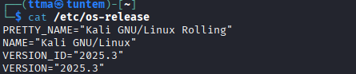
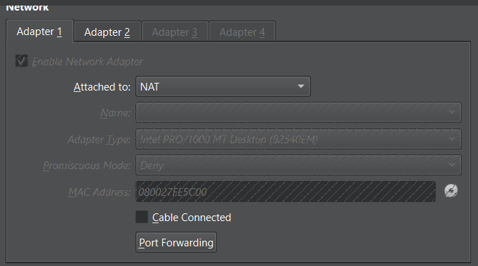
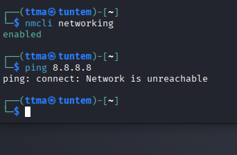

# h1 Sniff
Kotitehtävä h1 Sniff Tero Karvisen Verkkoon tunkeutuminen ja tiedustelu - 2025 syksy kurssille. [Linkki kurssisivulle](https://terokarvinen.com/verkkoon-tunkeutuminen-ja-tiedustelu/)
Jokaisessa kohdassa on alla olevalla "quote" tyylillä kerrottu tehtävänanto.
>Liirum laarum laa...
## Tehtävät

### a)

>Linux. Asenna Debian tai Kali Linux virtuaalikoneeseen. (Tätä alakohtaa ei poikkeuksellisesti tarvitse raportoida, jos sinulla ei ole mitään ongelmia. Jos on mitään haasteita, tee täsmällinen raportti)

Minulla oli jo uusin Kali asennettuna virtualboxiin. 

### b) 

>Ei voi kalastaa. Osoita, että pystyt katkaisemaan ja palauttamaan virtuaalikoneen Internet-yhteyden.

Netin voi ottaa pois käytöstä Kalista komennolla `nmcli networking off` sekä laittaa takaisin päälle ``nmcli networking on``

Netin voi myös ottaa pois Virtualboksista menemällä kyseisen virtuaalikoneen asetuksiin ja ottamalla ruksin pois kohdasta ``"Cable connected"``

# Lähteet
